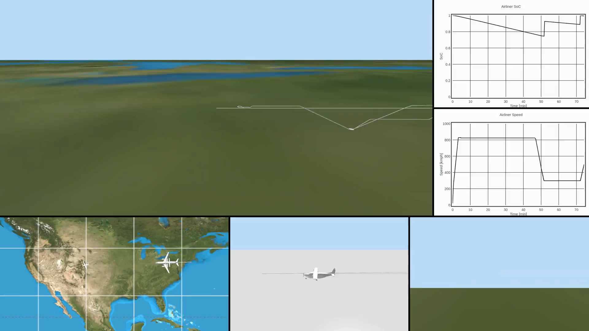

# Design and Feasibility Study of Mid-Air Refueling of a Hydrogen-Powered Airliner

> *Read the docs [**here**](https://keeganmjgreen.github.io/green_airliner/index.html).*

<!-- Working video link generated by uploading `video_presentation-h264-385kbps-60fps-720p.mp4` into a unsubmitted GH issue as `Video.Presentation.mp4`. -->
https://github.com/user-attachments/assets/07233b42-c89e-4d8f-b650-e37567e21865

A walkthrough of this video presentation can be found [**here**](https://keeganmjgreen.github.io/green_airliner/7_simulation/7_simulation.html).

# Getting Started

## Setup

This assumes that you are using a Linux-based OS and have Conda installed.

1. Set the required environment variables by copying the `.env.example` file as `.env` and filling it in.
2. Create the Conda environment by running `conda env create -f environment.yml`.

The above is only first-time set-up.

1. Ensure you are in the repo directory (e.g., using `cd`).
2. Activate the Conda environment by running `conda activate green_airliner`.

## Running the Feasibility Study

Run the feasibility study with its default configuration (after following the instructions in "Setup") using the following command:

```bash
python src/feasibility_study/feasibility_study.py
```

## Running the 3D Simulation

The 3D simulation is run by `src/three_d_sim/simulation.py` (the program's entry point). The 3D simulation can be run from the command line (after following the instructions in "Setup") using the following command:

```bash
python src/three_d_sim/simulation.py --config-dir=... --view=... --track-airplane-id=... --record=...
```

For example:

> ```bash
> python src/three_d_sim/simulation.py --config-dir=configs/jfk_to_lax/ --view=side-view --track-airplane-id=Airliner
> ```
>
> Specifying `--config-dir=configs/jfk_to_lax/` uses the `simulation_config.yml` file in that directory to configure the simulation with an airliner flying from JFK to LAX via PIT (Pittsburgh) and DEN (Denver) international airports. The schema and documentation for the simulation config file can be found [**here**](https://keeganmjgreen.github.io/green_airliner/7_simulation/7_1_configuration.html). Specifying `--view=side-view` and `--track-airplane-id=Airliner` results in the camera following the airliner from a side view.

The 3D simulation is rendered via VPython in a browser tab. Unless `--view=map-view`, the camera follows the airplane specified by `--track-airplane-id`. The browser view consists also of some text-based readouts for the airplanes, and realtime graphs of the airliner's speed and SoC over time.

The browser tab opens in your system's default browser. With the assumption that this is Google Chrome, the program firstly and automatically opens a new "guest" Chrome window in which this new browser tab will be opened. The program will stop (and the 3D rendering will freeze) after the airplane (specified by `--track-airplane-id`) lands, but it can be stopped early when running from the command line by pressing `Ctrl`+`C` therein. After, the "guest" Chrome window can be closed.

Specifying ` --record=viewport` records the 3D rendering and saves it to a `.avi` video file with a specific name. Because newer VPython no longer supports opening 3D renderings in standalone windows and the functionality to write the 3D rendering to a video file seems to no longer work, this is done by screen-recording region(s) of the screen whose coordinates are hard-coded in `simulation.py`. While automatic, a consequence is not being able to use that screen region for other purposes during simulation/recording. An advantage over manual screen-recording, however, is that the recorded frame rate is fixed and synced with the simulation, and thus unaffected by any lags in running the program.

Specifying `--record=graphs` is similar, but records both the airliner's speed graph and SoC graph to separate video files.

To disable screen-recording to a video file, do not use the `--record` argument.

### Different visualizations

Each of the visualizations ("video feeds") in the following screenshot from the video presentation are generated by running the simulation with different command line arguments. This section provides the commands for each of these video feeds.



#### Side views of airplanes

Airliner:

```bash
python src/three_d_sim/simulation.py --view=side-view --track-airplane-id=Airliner --record=viewport
```

UAVs from PIT:
  - First UAV (leading up to PIT flyover):
    ```bash
    python src/three_d_sim/simulation.py --view=side-view --track-airplane-id=PIT_UAV_0 --record=viewport
    ```
  - Second UAV (directly after PIT flyover):
    ```bash
    python src/three_d_sim/simulation.py --view=side-view --track-airplane-id=PIT_UAV_1 --record=viewport
    ```

UAVs from DEN (only the first two UAVs, leading up to the DEN flyover):
  - ```bash
    python src/three_d_sim/simulation.py --view=side-view --track-airplane-id=DEN_UAV_0 --record=viewport
    ```
  - ```bash
    python src/three_d_sim/simulation.py --view=side-view --track-airplane-id=DEN_UAV_1 --record=viewport
    ```

#### "Bird's eye" (map) view of all airplanes

The following command specifies `--view=map-view` to show a "bird's eye" (map) view of all the airplanes (airliner and UAVs). The airplanes' 3D models are scaled up (and their altitudes increased) for illustrative purposes, such that they remain visible.

```bash
python src/three_d_sim/simulation.py --view=map-view --record=viewport
```

#### Airliner speed and SoC graphs

The airliner's speed and SoC graphs are already shown in the browser tab. The following command specifies `--record=graphs` to screen-record them.

```bash
python src/three_d_sim/simulation.py --view=side-view --track-airplane-id=Airliner --record=graphs
```

### Making the video presentation

The video presentation has three parts: (1) an intro, (2) a middle, and (3) a conclusion. The middle part is a composite of the different video feeds from the previous section. Each part of the video presentation is made using [Manim](https://www.manim.community/). The Python script fed to the `manim` command is `manim_videos.py`. Finally, the parts are concatenated into the video presentation using `combine_manim_videos.py`.

#### Making each part of the video presentation

The following are commands for making each part of the video presentation at up to 1080p resolution and 60 FPS. To render faster but with lower quality, replace `1080p60` with `720p30` or `480p15`.

- (1) Making the presentation's intro (`Intro.mp4`):

  ```
  cd ${VIDEO_DIR} && manim -qH ${REPO_DIR}/manim_videos/manim_videos.py Intro && vlc ${VIDEO_DIR}/media/videos/manim_videos/1080p60/Intro.mp4
  ```

- (2) Making a composite of the the video feeds (`Video.mp4`):

  ```
  cd ${VIDEO_DIR} && manim -qH ${REPO_DIR}/manim_videos/manim_videos.py Video && vlc ${VIDEO_DIR}/media/videos/manim_videos/1080p60/Video.mp4
  ```

- (3) Making the presentation's conclusion (`Conclusion.mp4`):
  ```
  cd ${VIDEO_DIR} && manim -qH ${REPO_DIR}/manim_videos/manim_videos.py Conclusion && vlc ${VIDEO_DIR}/media/videos/manim_videos/1080p60/Conclusion.mp4
  ```

#### Concatenating the parts into the video presentation

The following command concatenates the three parts into the final video presentation (`video_presentation.mp4`):

```
cd ${VIDEO_DIR} && python ${REPO_DIR}/manim_videos/combine_manim_videos.py --work-dir=${VIDEO_DIR}/media/videos/manim_videos/1080p60/ && vlc ${VIDEO_DIR}/media/videos/manim_videos/1080p60/video_presentation.mp4
```

## References for development

### Generating the documentation locally

The documentation can be generated (using Sphinx) locally using the following commands.

First-time setup for generating LaTeX documentation only:

1. Run `sudo apt install latexmk`.
2. Run `sudo apt install --fix-missing texlive-latex-extra`.

Generate the HTML documentation (LaTeX currently disabled) by running:

```bash
source docs/documentation_workflow.sh
```

This script, among other things, automatically converts the `SimulationConfig` Pydantic model to JSON Schema and an interactive HTML page embedded in the documentation.
