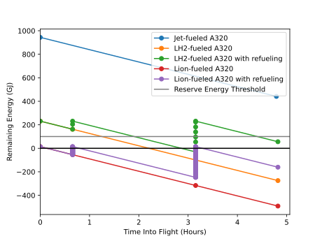

Feasibility Studies with Different Energy Storage Media
=======================================================

Given the selected airliner and UAV, studies are performed for different energy storage media to determine whether they can sustain flight and, if so, the number of UAVs required to refuel the airliner at the given airports. The energy storage media include jet A1 (for comparison purposes), liquid hydrogen (LH₂), lithium-ion batteries (Li-ion), and lithium-polymer batteries (LiPo). These will often be referred to as "fuels" for simplicity.

The number of UAVs as well as the rate at which each fuel capacity is consumed will also be compared.

First, a real airliner route will be selected as the common scenario in which to run the studies.

Selection of the Airliner Route for Feasibility Studies
-------------------------------------------------------

The airline route from JFK (John F. Kennedy International Airport) to LAX (Los Angeles International Airport) was selected for studies because it is a most frequented airliner route in North America and because it is of reasonable length. Furthermore, it strikes a balance between not flying over too few airports over which to refuel (as in inter-continental flights) and having the luxury of flying over many airports (as in Europe, for example, but cannot be expected globally).

Straight-line distances across the surface of the earth will be assumed for studies. Accordingly, JFK and LAX are approximately 4000 km apart. Neglecting time and energy particular to takeoff, landing, and taxiing, and assuming cruise speed throughout, the selected airline route would take 4 hours 48 minutes and consume 503 GJ of energy, or 53% of the jet A1 capacity of an A320ceo.

The airliner can deviate somewhat from its regular JFK--LAX flight path and fly over relatively nearby airports to be refueled, such as PIT (Pittsburgh International Airport) and/or DEN (Denver International Airport). The following table shows the distances, and corresponding durations at A320ceo cruise speed, directly from JFK to LAX versus via detour components through PIT and DEN::

                       Distance (km)    Duration    CO₂ Emissions
    ―――――――――――――――――――――――――――――――――――――――――――――――――――――――――――――
    Before detours:
    JFK–LAX                    3,972       04:47
    ―――――――――――――――――――――――――――――――――――――――――――――――――――――――――――――
    Detours:
    JFK-PIT                      544       00:39
    PIT–DEN                    2,070       02:29
    DEN–LAX                    1,384       01:40
    Total: JFK–PIT–DEN–LAX     3,998       04:49

Geographically, a detour over DEN in particular may not be considered negligible, however the total detour only adds 26 km, or 2 minutes, to the total flight time.

The direct (JFK–LAX) and JFK–PIT–DEN–LAX flight paths (straight-line flight paths) are illustrated as follows:

.. image:: airport_locations_mapbox.png

Jet A1 Fuel---The Baseline
--------------------------

Jet A1 is the main fuel used by commercial airlines around the world, owing to its energy properties and current abundance and affordability. It has a high energy density (energy per liter) and high specific energy (energy per kilogram). Jet A1 is by far the most practical fuel for air travel and, without it, commercial flight would not be what it is today. Jet A1 is globally standardized to have certain physical and chemical properties, making it practical and desirable. Because of this, it is used as a baseline for the studies to be discussed. Jet A1 fuel is an airline's largest expense simply because of the massive amount of energy needed to sustain flight, but over the course of the past decade, it has costed no more than about US$3/gallon (with the exception of spikes which may be attributable to the Russian invasion of Ukraine starting 2022). However, as a petroleum-based fossil fuel, its extraction (in the form of crude oil), distribution, and consumption for aviation have major environmental consequences, its consumption releasing massive amounts of greenhouse gas (GHG) emissions.

It should be noted that only one third of aviation's warming of earth is caused by CO₂; most of the remainder is caused by contrails. Contrails are composed of water vapor introduced into the atmosphere as a waste product of burning jet fuel. Water vapor is also a GHG but with a greater warming effect than CO₂. However, water vapor leaves the atmosphere at a rate such that its half-life is about two weeks, whereas the corresponding half-life of CO₂ is about a century. Nonetheless, most of aviation's warming of earth is caused by water vapor. This should be accounted for when considering alternative fuels.

Jet fuel may be stored in simple tanks that are form-fitting to the internal shape and structure of airliner wings, thus making efficient use of the space available.

Aviation/Jet Biofuel
--------------------

Biofuels are derived from biomass such as plants, animals, or waste. They are hydrocarbon-based fuels, as are fossil fuels, except rather than releasing carbon that was originally stored as fossil fuels, they release carbon that was absorbed in their production. This makes biofuels theoretically carbon-neutral; however, the reduction in emissions compared to conventional fuels depends on the type of biomass from which biofuel is made. Examples of biofuels are wood, ethanol, methane from animal waste, and drop-in aviation biofuel. When wood is burned, it releases carbon that the trees from which it was sourced absorbed in their growth, theoretically resulting in a net-zero carbon footprint. Ethanol (pure alcohol) is often refined from crops such as corn, which similarly take in carbon from the atmosphere and release it again when burned.

Drop-In Aviation Biofuel
^^^^^^^^^^^^^^^^^^^^^^^^

Drop-in aviation biofuel is appropriate biofuel that is refined to meet the standards of jet fuel (such as jet A1) which is typically fossil-fuel-based, such that it may be theoretically "dropped into" the fuel tank/engine of a jet-fueled aircraft without requiring any modifications or impacting performance.

A benefit of drop-in biofuels is that they may allow older and existing aircraft to continue to be used without having to design retrofits compatible with different types of fuel or having to manufacture new aircraft from scratch for such a purpose at great cost to the environment.

Aviation biofuel would reduce CO₂ emissions by 20% to 98%, depending on the type of biomass from which it is made.

Blends of conventional jet fuel and up to 50% biofuel have been allowed on commercial flights since 2011, but only 0.2% of jet fuel burned worldwide is aviation biofuel as of 2023, according to 600 million liters of production in that year.

.. Other Biofuels?
.. ^^^^^^^^^^^^^^

Electrofuels
------------

Electrofuels are hydrocarbon fuels that are synthesized from carbon and H₂. The carbon is sourced from capturing CO₂ or CO, and the H₂ is generated via the electrolysis of water using clean electricity such as wind, solar, or nuclear. Because the carbon released into the atmosphere when burning an electrofuel was first absorbed for manufacturing the electrofuel, it is theoretically carbon-neutral. In other words, rather than CO₂ being released into the atmosphere from some industrial process simply for being a useless waste product, this pollution is postponed by capturing the carbon and using it to generate a fuel using clean energy. The fuel is then burned later in an application where carbon capture is much less practical, such as in an airliner engine. The carbon is given a “second life” before being emitted. While arguments can be made regarding the carbon-intensive industrial process and carbon being emitted in either case, electrofuels would significantly decrease, though never eliminate, emissions. The barrier to using electrofuels is cost.

Hydrogen (H₂)
-------------

Hydrogen fuel is convenient to continue to use airliners that have a fuel-burning powerplant, albeit a powerplant (such as a turbofan engine) that is modified to work with hydrogen. Hydrogen is also convenient for airliners modified to have electric motors as their powerplants through the use of a hydrogen fuel cell, although how this might be implemented is out of the scope of the feasibility study. Hydrogen is not a drop-in fuel like aviation/jet biofuel, meaning that it cannot be used to replace jet fuel without a different or modified powerplant.

Hydrogen only avoids CO₂ emissions if it is:

- Generated from electrolysis using clean and/or renewable electricity ("green hydrogen") rather than through refining fossil fuels as most hydrogen currently is; or

- Refined from fossil fuels with the resulting carbon being stored rather than released into the atmosphere.

Water (or water vapor) is the only waste product of extracting energy from hydrogen, making it a notable candidate for a clean alternative fuel. But if water vapor is emitted into the atmosphere as a result, it will only partially solve aviation's warming of earth due to water vapor's warming effect.

**Gaseous hydrogen** (H₂) burns clean, can be used at room temperature in a fuel cell, and can be produced from electricity (ideally clean electricity) via electrolysis. The limitations of gaseous hydrogen storage owing in large part to its abismal energy density, however, represent a more practically important consideration. Where jet A1 has an energy density of 34.7 MJ/L, gaseous hydrogen has an energy density of 0.01 MJ/L. In addition, as H₂ is a smaller molecule than any hydrocarbon, it may pose a risk of leaks in hydrogen infrastructure from distribution, to refueling, to storage onboard airliners.

Gaseous hydrogen may be compressed to pressures such as ~350 and up to ~700 atmospheres, these pressures being used in hydrogen-powered road vehicles, thereby increasing its energy density compared to unpressurized hydrogen. This would result in energy densities of 3.472 and up to 6.943 MJ/L, respectively, making it still a poor contender to jet A1. Nonetheless, technology similar to that used when refueling hydrogen cars may be used.

.. Gaseous hydrogen pressures from https://en.wikipedia.org/wiki/Hydrogen_storage
.. Pressurized hydrogen energy densities: 0.01005 MJ/L * [350, 700] bar / (1.01325 bar/atm) = [3.472, 6.943] MJ/L
.. https://en.wikipedia.org/wiki/Hydrogen_storage#/media/File:Storage_Density_of_Hydrogen.jpg

**Liquid hydrogen** (LH₂) is stored at around −250°C and between 1 and ~4 atmospheres, resulting in a density of around 0.067 kg/L.

An LH₂-powered airliner can be refueled by ground equipment at a rate of about 2 GW, which will be assumed for mid-air refueling as well for simplicity. Unfortunately, LH₂ is very likely not an option (economically speaking, in the long-term) if for no other reason than the price of the helium that would be needed for purging as part of the LH₂ refueling process to protect against explosions. An explosion risk *may* be acceptable if an airliner were refueled only on the ground, free of personnel, and far away from an airport terminal, such that the only risk is posed to the airliner itself. However, this is not acceptable while the airliner is mid-air and full of passengers. If LH₂-fueled airliners saw widespread adoption, this may cause the price of helium to prohibitively skyrocket and helium to become more rare. [1]_

.. "...for reasons of safe handling and compliance with explosion protection, a purging process is necessary [43]—so no foreign gases remain in the hoses. Helium is required for this purging process [30], as at cryogenic temperatures of 20 K, all substances except helium (boiling point of 4.2 K [35]) would freeze and block the pipe [44,45]. Helium has the further advantage of being an inert gas that does not form chemical reactions and dissolves only slightly [31]. On the downside, Helium is an expensive, non-renewable inert gas [46] that should ideally not be used in regular operation. A massive increase in helium consumption could raise the price to such an extent that using LH2 as a fuel would become uneconomical."

.. [1] `Refueling of LH2 Aircraft---Assessment of Turnaround Procedures and Aircraft Design Implication <https://www.mdpi.com/1996-1073/15/7/2475>`_.

**Cryo-compressed hydrogen** (hydrogen in a transcritical state) is stored at temperatures ranging from −240 and −200°C, and at pressures ranging from ~500 to ~1000 atmospheres, resulting in a density from around 0.074 to 0.102 kg/L.

There are established ways of storing compressed hydrogen, liquid hydrogen, and cryo-compressed hydrogen. Compressed hydrogen is stored in tanks of suitable material to withstand the pressure and prevent leaks, such as Type I (steel) or Type IV (carbon composite) hydrogen tanks, as currently used in hydrogen cars and when trucking hydrogen to hydrogen car refueling stations. The tanks are cylindrical with two semispherical ends, to withstand the high pressures. Such tanks arranged in an airplane wing would result in much wasted space between them. Liquid hydrogen must be stored in tanks that are insulated and/or cooled to maintain a temperature near absolute zero. Cryo-compressed hydrogen demands the storage needs of both compressed and liquid hydrogen, the weight required of which adds to the impracticality of storing in a wet wing and calls for storage in a modified fuselage, even if such a fuselage is aerodynamically worse off. However, whatever the location or shape of the fuel storage, this study assumes the same volume of hydrogen as jet A1.

Because of the economically inviable helium requirement and other storage complexities of liquid hydrogen (including cryo-compressed hydrogen), gaseous hydrogen compressed to 700 bar (or higher if possible) may be used.

Lithium-Ion and Lithium-Polymer Batteries
-----------------------------------------

Lithium-ion and lithium-polymer batteries are convenient for airliners modified to have electric motors as their powerplants. The two battery chemistries are similar, with comparable energy densities / specific energies. The batteries' cost, lifespan, and replacement cost are not discussed here---nor are the power or efficiency of battery management systems. It is assumed that the ratio between mass or volume of battery reactants to other battery components is similar regardless of the number or size of batteries or battery cells. Furthermore, it is assumed that this mass and volume may be packed fully into the fuel mass and volume capacity (whichever is reached first) of the airliner.

The rate at which an airliner with lithium-ion and lithium-polymer batteries can be recharged is limited by systems such as the Megawatt Charging System and poses a blatant bottleneck to mid-air recharging, paling in comparison to the previously mentioned rate at which an airliner such as the A320 consumes energy.

As an example of a commercial airplane using lithium batteries, the Alice airplane developed by *Eviation* is considered a novel innovation in aviation at the time of writing and is electrically powered. However, Alice is implemented far from the scale of a narrowbody commercial airliner; it carries only nine passengers, has a 407-km/h cruise speed and 463-km range---both of which have been reduced during development. The size, cruise speed, and range are all fractions of what are expected of an airliner, especially a jet-fueled one. Alice uses two electric motors powered by a 3.72-tonne, 820-kWh lithium-ion battery. For reference, large electric buses have half as much battery capacity as this.

Comparisons Between Different Energy Storage Media
--------------------------------------------------

The following table compares the energy densities and densities of fuels and other energy storage media::

    Fuel              Energy Density (MJ/L)    Density (kg/L)     Specific Energy (MJ/kg)
    ―――――――――――――――――――――――――――――――――――――――――――――――――――――――――――――――――――――――――――――――――――――
    Jet A1                          34.7       0.804 (at 15°C)                      43.2
    ―――――――――――――――――――――――――――――――――――――――――――――――――――――――――――――――――――――――――――――――――――――
    GH₂ at STP *                     0.01005   0.00008988                          119.93
    GH₂ at 345 atm *                 3.472     0.03105                                  "
    GH₂ at 691 atm *                 6.943     0.06209                                  "
    LH₂ *                            8.497     0.07085                                  "
    Cryo-compressed H₂ *            11         0.088                                    "
    ―――――――――――――――――――――――――――――――――――――――――――――――――――――――――――――――――――――――――――――――――――――
    Li-ion                      0.90–2.49      0.360–0.954
                               Mean: 1.70      Mean: 0.657                           2.57
    LiPo                        0.90–2.63      0.36 –0.95
                               Mean: 1.77      Mean: 0.66                             2.7

    * The energy density and specific energy specifically use the Lower Heating Value (LHV).

.. TODO why LHV used

Jet A1 fuel is practical, besides the unfortunate fact that it is extremely inexpensive per liter, because it has both a good energy density (34.7 MJ/L) and specific energy (43.2 MJ/L). LH₂ has a much higher specific energy (119.93 MJ/kg) but a much lower energy density (8.497 MJ/L). Both Li-ion and LiPo have poor energy densities and specific energies; note that their mean values have been taken to be conservative, although using one value or another for the Li-ion and LiPo energy storage media matters little as their energy densities and specific energy do not compare to jet A1 and LH₂.

The A320ceo can carry up to 27,200 L, or 21,900 kg, of jet A1 fuel. For the purposes of studies, it is assumed that the fuel capacity of the A320ceo will not be modified (though the energy storage media, with which it is filled, will be). The AT200 can carry up to 5,000 L or 1,500 kg of cargo---depending on whether the volume or the mass of the cargo is the limiting factor. It is also assumed for the purposes of the studies that no significant additional volume or weight will need to be carried by either the airliner or the UAV to support different fuels (which does not necessarily hold true for fuels such as LH₂).

The following table compares the volume, mass, and energy of fuels that the A320ceo airliner and AT200 UAV are capable of carrying based solely on their fuel/cargo capacity volumes---not yet considering their fuel/cargo capacity masses. Note that, for the AT200 UAV, fuel is referring to that with which it will refuel the airliner, which is treated as cargo. Asterisks indicate where the fuel/cargo capacity volume is correctly the limiting factor, which is always the case for the A320ceo (or, correspondingly, the fuel density always being too low), and for the AT200 with the exception of LH₂ due to its exceptionally low density. The Li-ion and LiPo fuels are less dense than jet A1, and LH₂ far less dense. Whereas the A320ceo has enough space for 21,900 kg of jet A1, only 1,930 kg of LH₂ can occupy the same space; whereas the AT200 has enough space for 4,000 kg of jet A1 (ignoring the 1,500-kg cargo capacity volume of the AT200), only 350 kg of LH₂ can occupy the same space. The fuel/cargo volume capacity is reached before the fuel/cargo mass capacity.

::

    Aircraft   Fuel      Fuel Volume (L)    Fuel Mass (kg)    Fuel Energy (MJ)
    ――――――――――――――――――――――――――――――――――――――――――――――――――――――――――――――――――――――――――
    A320ceo    Jet A1          *  27,200         *  21,900             944,000
               LH₂             *  27,200             1,930             231,000
               Li-ion          *  27,200            17,900              46,100
               LiPo            *  27,200            17,800              48,000
    ――――――――――――――――――――――――――――――――――――――――――――――――――――――――――――――――――――――――――
    AT200      Jet A1              5,000             4,000             170,000
               LH₂             *   5,000               350              40,000
               Li-ion              5,000             3,000               8,500
               LiPo                5,000             3,000               8,800

    Calculated values are rounded and significant
    figures are respected where reasonable.

The following table uses the fuel/cargo capacity masses. Asterisks indicate where the fuel/cargo capacity mass is correctly the limiting factor, which is always the case for the AT200 (with the exception of LH₂), indicating that the mass-to-volume ratio of the AT200 is poorly optimized for carrying many fuels.

::

    Aircraft   Fuel      Fuel Volume (L)    Fuel Mass (kg)    Fuel Energy (MJ)
    ――――――――――――――――――――――――――――――――――――――――――――――――――――――――――――――――――――――――――
    A320ceo    Jet A1          *  27,200         *  21,900             944,000
               LH₂               309,000            21,900           2,620,000
               Li-ion             33,300            21,900              56,400
               LiPo               33,400            21,900              58,900
    ――――――――――――――――――――――――――――――――――――――――――――――――――――――――――――――――――――――――――
    AT200      Jet A1              2,000         *   1,500              65,000
               LH₂                20,000             1,500             180,000
               Li-ion              2,000         *   1,500               3,900
               LiPo                2,000         *   1,500               4,000

    Calculated values are rounded and significant
    figures are respected where reasonable.

The following table uses both the fuel/cargo capacity volumes and masses to obtain the correct values; it is a merging of the previous two tables. Asterisks indicate where the fuel/cargo capacity volume or mass is the correct limiting factor. The limited fuel/cargo capacity volume of the A320ceo and AT200 prevent them from being able to carry up to 2,620 and 0.18 GJ of energy, respectively, as that would require 309,000 and 20,000 L of space---11× and 4× what the A320ceo and AT200 provide.

::

    Aircraft   Fuel      Fuel Volume (L)    Fuel Mass (kg)    Fuel Energy (MJ)
    ――――――――――――――――――――――――――――――――――――――――――――――――――――――――――――――――――――――――――
    A320ceo    Jet A1          *  27,200         *  21,900             944,000
               LH₂             *  27,200             1,930             231,000
               Li-ion          *  27,200            17,900              46,100
               LiPo            *  27,200            17,800              48,000
    ――――――――――――――――――――――――――――――――――――――――――――――――――――――――――――――――――――――――――
    AT200      Jet A1              2,000         *   1,500              65,000
               LH₂             *   5,000               350              40,000
               Li-ion              2,000         *   1,500               3,900
               LiPo                2,000         *   1,500               4,000

    Calculated values are rounded and significant
    figures are respected where reasonable.

    1 MJ is 0.28 kWh.

The A320ceo can store 4 times as much energy in the form of jet A1 (944 GJ or 262 MWh) as it can store as LH₂ (231 GJ or 64.2 MWh). Even at capacity, this is not enough LH₂ to maintain operations. Notably, at 46.1 GJ or 48.0 GJ, Li-ion or LiPo batteries are out of the question.

The AT200 can store 40 GJ of LH₂---62% as much as it can store jet A1 (in terms of energy) due to its large cargo volume-to-mass ratio.

Whereas a jet-A1-fueled A320ceo need not take off with its maximum capacity of fuel unless flying its maximum range, a LH₂-fueled A320ceo would take off with maximum capacity to minimize the number of times it must be refueled by UAV. Notably, carrying this extra capacity of a fuel that is no less dense than jet A1 would result in decreased efficiency, whereas carrying LH₂ results in increased efficiency due to its low density.

An LH₂-fueled A320ceo would need to be refueled by 7 UAVs to have the same range as a jet-A1-fueled A320ceo. Note that the deviations from the regular flight path to be refueled over airports en route would increase the distance traveled (thereby reducing the effective range) somewhat.

Assuming that the A320ceo starts with maximum fuel, the following graph illustrates its energy level over time from JFK to LAX, parameterized by different energy storage media and whether or not the A320ceo is refueled the minimum required amount to stay above a 100-GJ reserve level where possible. If refueled, the A320ceo is refueled over PIT and DEN as many times as necessary for it to stay above the reserve level by the time it reaches its next airport.

Selection of hydrogen fuel as the energy storage media
------------------------------------------------------

.. TODO
