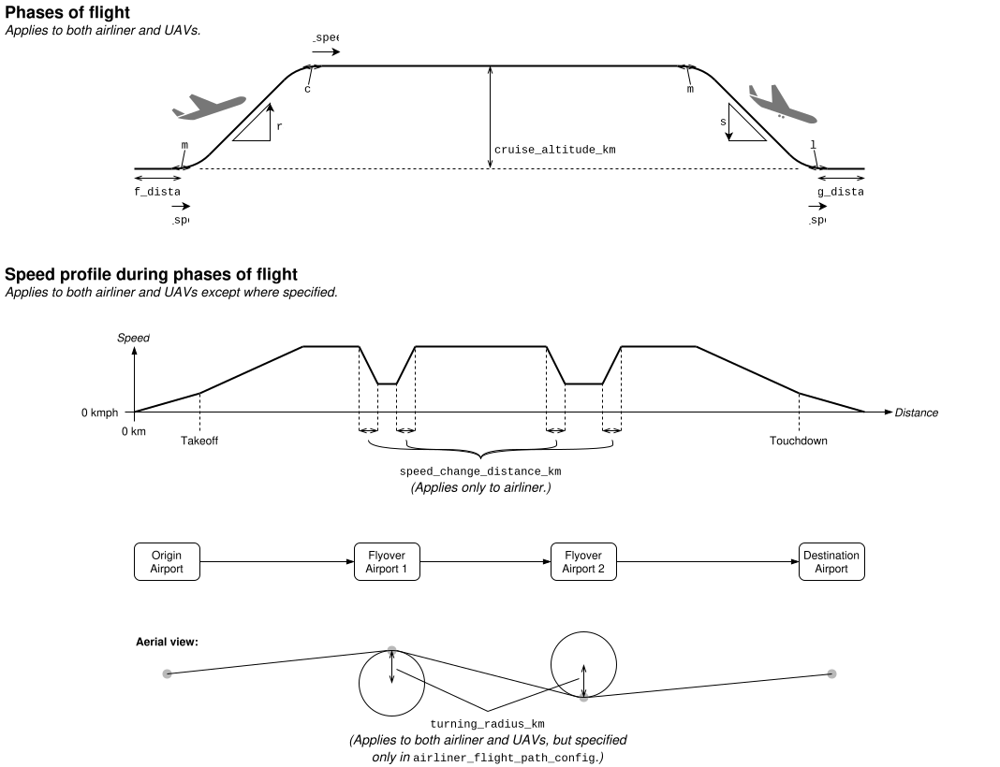

Configuration
=============

The simulation is configured by a ``simulation_config.yml`` file in the specified ``--config-dir``. This YAML file must follow the following schema.

Schema
------

The following schema is a full specification of the simulation config, including its required and optional fields, their data types, and descriptions.

.. raw:: html

    

        <iframe src="../_static/simulation_config_json_schema.html" style="flex-grow: 1; width: 100%; border: 1px solid #dfdfdf;"></iframe>
    

Example for flight from JFK to LAX
----------------------------------

The following is an example ``simulation_config.yml`` file for a flight from JFK to LAX.

.. collapse:: Click to expand/collapse.

    .. literalinclude:: ../../configs/jfk_to_lax/simulation_config.yml
        :language: yaml

Flight path configuration
-------------------------

The simulation config includes configuration of the airliner and UAVs' flight paths. The following diagrams explain a number of fields of the airliner and UAVs' flight path configs in the context of the airplanes' phases of flight, speed profile, and flight between airports.

UAV flight path
^^^^^^^^^^^^^^^

The following diagram shows the path of PIT-UAV-0 according to the example ``simulation_config.yml`` file. The `xy`-plane is to-scale but the vertical `z`-axis is scaled up to more clearly illustrate the altitude differences. The diagram shows some additional fields specific to the UAVs' flight path config. The diagram also shows certain points---waypoints---along the UAV's path. For example, when the UAV takes off, has reached its cruise altitude, begins to descend onto the airliner, etc. (These waypoints are labeled in the diagram, and their labels can be referenced when specifying the ``elapsed_mins`` of ratepoints or zoompoints.)

.. image:: airplane_paths/PIT-UAV-0.svg

The following diagram shows all airplane paths surrounding PIT (airliner, PIT-UAV-0, and PIT-UAV-1). It is to-scale and was generated using ``study_runner.py``'s ``airplane-paths`` subcommand.

The following diagram shows the paths of DEN-UAV-0 and DEN-UAV-1 according to the example ``simulation_config.yml`` file.

TODO

The following diagram shows all airplane paths surrounding DEN.

.. image:: airplane_paths/DEN.png
