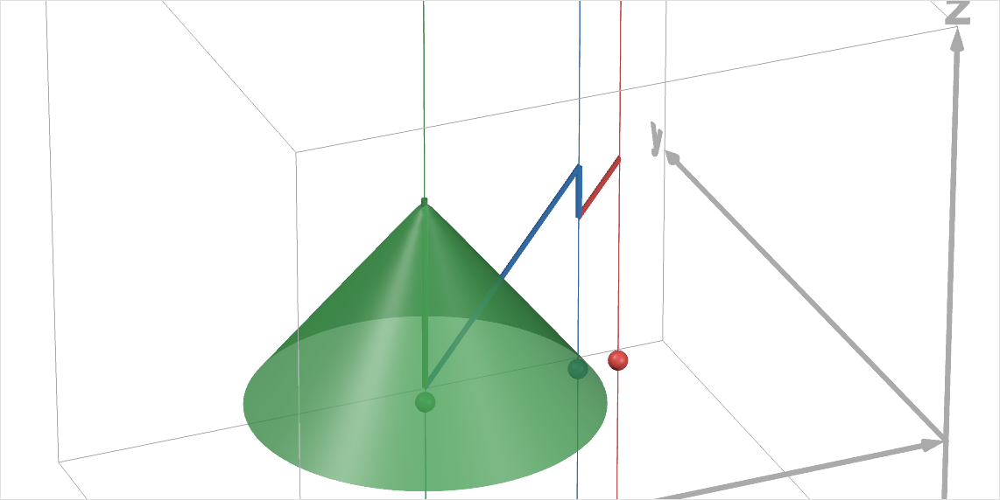
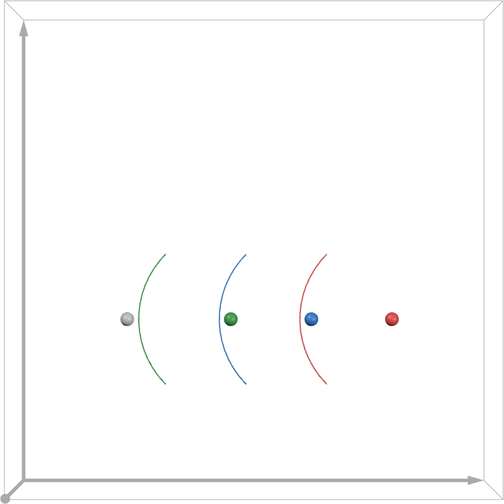

Optimizing the Airliner Flight Plan in Terms of Flyover Airports
================================================================

Better understanding the range and flight plan of a hydrogen-fueled A320
------------------------------------------------------------------------

.. note:: Previously, energy levels have been expressed in base units of joules (or watt-hours) to be able to meaningfully compare them even when the aircraft's energy storage capacity differs. However, after selecting hydrogen fuel as the energy storage media, the energy level expressed as a fraction of the aircraft's energy storage capacity will be used to make comparisons even easier when constantly working with the hydrogen-fueled A320. In battery electric vehicles, this energy level is referred to as State of Charge (SoC) and is usually expressed as a percentage of the battery energy capacity. Hereafter, the term SoC will be adopted for the hydrogen-fueled A320 for convenience.

To better understand the range and overall flight plan of a hydrogen-fueled A320, we can visualize how its SoC changes as a function of the airliner's location along its flight path. This can also be generalized by visualizing how the SoC falls as a function of distance from each airport, which will be useful when optimizing the flight plan in terms of choosing which airports the airliner will fly over for refueling.

To do so, a (lon, lat, SoC) graph in 3D space is used:

.. image:: lat_lon_soc.png
    :width: 75%

- The :math:`x`-, :math:`y`-, and :math:`z`-axes are longitude, latitude, and SoC, respectively.
- The colored points are the (longitude, latitude) coordinates of airports: JFK (red), PIT (blue), DEN (green), and LAX (orange).
- The thick colored lines show the SoC of the airliner decreasing between airports and the SoC increasing rapidly again when the airliner flies over the flyover airports and is refueled in mid-air.

The range of the airliner from any one airport can be visualized, starting with JFK international airport, as follows. The SoC is modeled to decrease linearly with distance from the origin airport, resulting in an inverted cone surface. The circular intersection of the cone with the horizontal, zero-SoC plane represents the energy of the airliner being fully depleted. The radius of this circular intersection then represents the maximum range of the airliner (neglecting a reserve energy level).

.. image:: lat_lon_soc_1_jfk.png
    :width: 75%
    :align: center

If the destination airport is not within this range (as is expectedly the case), any airport within the range can and must be selected as an flyover airport over which to fly and be refuelled. While flying in the completely opposite direction of the destination airport is obviously undesirable and may filter out a number of candidates, it is not in general obvious which candidate of flyover airport would be best and by what metric. In general, some questions arise regarding the selection of the flyover airport:

1. Should the flyover airport be the one closest to the destination airport?
2. Should the flyover airport be the one closest to the direct flight path that a jet-fueled airliner would have taken to the destination airport?

We will refer to these as criterion 1 and 2. While it may appear that the airport selected by criterion 1 would necessarily be the same as that selected by criterion 2, and vice versa, this is in general not the case. In an extreme and illustrative example, an flyover airport "a" could be 2000 km in the very rough direction of the destination airport, while another flyover airport "b" could be a mere 100 km away and extremely close to a direct flight path to the destination. Neglecting for now the inefficiency of refueling at airport "b" so close to the origin airport, the flyover airports "a" and "b" would be the obvious choices by criteria 1 and 2 respectively---but airports "a" and "b" are strikingly different.

In any case, if PIT is selected as the flyover airport, then the airliner can be refueled and we repeat the process by again modeling a linear decrease in SoC as the airliner flies from PIT in a yet-undecided direction:

.. image:: lat_lon_soc_2_pit.png
    :width: 75%
    :align: center

DEN is selected as the next flyover airport. The process can be repeated until the destination airport (LAX international airport) is within range of the airliner (with some reserve fuel), as is now the case in flying from DEN to LAX.

Extreme cases
-------------

The following examples use extreme cases to illustrate two principles that always apply when selecting flyover airports.

Extreme case 1
^^^^^^^^^^^^^^

In an extreme case, the two flyover airports are situated directly along the straight-line flight path from the origin airport (red) to the destination airport (gray):

The flyover airports are just within range. As a result, the number of flyover airports is at a minimum. This also means that the airliner would be refueled more times per airport and would thus not need to slow down as often for refueling.

However, the destination airport (which could as well be the next required flyover airport) is marginally out of range, rendering the entire flight path infeasible. This example illustrates that there can be no feasible---let alone optimal---choice of flyover airport without considering the overall flight path.

Extreme case 2
^^^^^^^^^^^^^^

Consider the following other extreme case with the same origin and destination airports as in the previous example:

.. image:: bad_yet_best.png
    :width: 50%
    :align: center

A flight path following these flyover airports is undesirable for two reasons:

- The total distance of the flight path is very long due to the extreme detour required.

- The total time of flight is very long not only due to the long distance but also due to the frequency at which the airliner must slow down over flyover airports for refueling. Flyover airports 2 and 4 and marginally beyond the range of the airliner from flyover airports 1 and 3, meaning that the airliner must refuel at more airports (and, in the case of airport 3, fly farther).

However, this example illustrates that the feasible (or optimal) choices of flight paths (in this case only one) are not necessarily intuitive or intuitively good.

Optimizing the selection of flyover airports
--------------------------------------------

The total flight time or distance may be minimized by selecting an optimal flight path in terms of the flyover airports. Again, while very similar, minimizing flight time and minimizing distance are not necessarily equivalent objectives because the airliner will take additional time while slowing down, preparing for refueling, and returning to cruise speed. As a consequence, refueling once at multiple airports would require more of this additional time than refueling multiple times at one airport.

As illustrated in the first extreme case, a feasible solution---let alone a global minimum---will not necessarily be achieved if the selection of a flyover airport is naive to how that choice will affect the future selections and proximities of airports. Any optimization of the flight path must not be greedy optimization.

Indeed, the choice of earlier decision variables in the optimization problem affects the options of later decision variables as well as how well they can contribute to optimality.

The optimization problem is a combinatorial one. Solving such an optimization problem represents solving a nonsmooth integer program.
